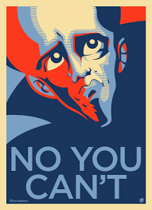

# Burglar-Game-demo-
Burglar Game demo I made in Godot to learn Godot features.

# Game includes:
- Randomized Mob movement with a Navigation Area for collission Avoidance
- Player detection in form of RayCast Arrow, Mob will follow Player when Player collides with the Mob's RayCast Arrow
- Simple Player movement and Animation designed for a top-down esque game.

# Game Mechanics:
- Game is won by collecting all golden colored coins.
- Start timer of 1 Minute. Collect all coins before the timer ends
- Powerup coins are also available to collect, the game cannot be beat if you do not use them. (TRUST)
- Simple WASD and arrow movements

# Game needs:
- Could not figure out for the life of me how to attach the flashlights to the RayCast, needs to be fixed
- Better graphics? Looks pretty basic at the movement
- Fixing collission on Mobs. At the moment mobs collide with other mobs. Not ideal

